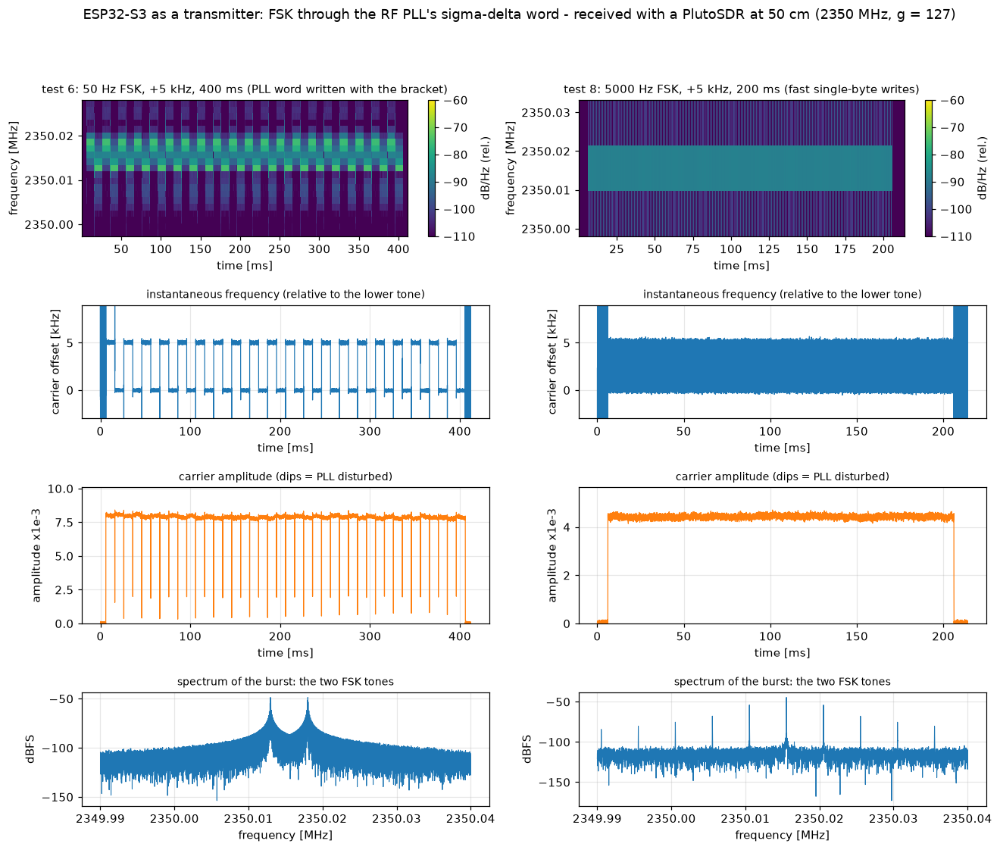

# Can the ESP32-S3 transmit? Research notes

Status: research, nothing here is part of the supported firmware. The narrowband build never transmits.

## Stage 0: what the vendor PHY library does for a TX tone (disassembly only, nothing measured)

Source: `libphy.a` and `librftest.a` of ESP-IDF 5.5 (`components/esp_phy/lib/esp32s3`), read with `objdump -dr`. Everything below is
read from instruction sequences and is **inferred**; field names are guesses until a measurement confirms them.

* `start_tx_tone_step(a, i, g, b, q, h)` (`phy_reg.o`) writes the frontend registers `0x60006040` (I side) and `0x60006044` (Q side):
  bits 9:0 a signed value (`i` or `q` shifted right by 2; the two low bits go to `0x60006050` bits 1:0 and 3:2 when bit 29 of
  `0x60006040` is set), bits 17:10 the negated byte `g` (or `h` for Q), bits 25:18 the byte `a` (or `b` for Q). If `a | b` is not
  zero, bit 26 of `0x60006000` is cleared and bit 10 of `0x600061e4` is set; otherwise the opposite. That pair of bits looks like
  the switch between normal baseband TX data and these constants. The registers hold constants, so I and Q are
  DC levels: the transmitter is a carrier at the LO, offset in phase and amplitude by (I, Q).
* `start_tx_tone` is a wrapper that scales `i` and `q` by 32/5 (10-bit mode) or 128/5 (12-bit mode) first.
* `phy_txtone_start(freq_mhz16, offset_s16, gain8)` (`phy_feature.o`): `set_rf_freq_offset` (→ `set_rfpll_freq(chan, freq, offset)`),
  `target_power_backoff(min(gain - 12, 127))`, sets bit 1 of `0x60006000`, writes a power field into bits 17:10 of it, calls two
  `g_phyFuns` hooks, then `start_tx_tone_step(1, 0, <gain byte>, 0, 0, 0)`: I = constant 1, Q = 0. So a "tone" is the LO with a
  constant baseband level of 1.
* `phy_set_freq(freq_mhz16, offset_s16)` also ends in `set_rfpll_freq`. This firmware already owns the PLL (`tune_pll()` in
  `esp32s3/src/radio.c`), so the transmit frequency would come from the same synthesizer plan as in receive.
* `force_iq_set` (`librftest.a`) writes `0x6000607C`, the receive I/Q correction register (see `board.h`). It is not the transmit path.
* `stop_tx_tone` clears bits in `0x60006040/44/4c` and sets bit 26 of `0x60006000` again.

What this suggests, to be tested: if the hardware samples these registers continuously, writing `0x60006040/44` from the CPU gives an
I/Q source of CPU speed, limited by the 8/10-bit fields and by the filters after them. A DC value gives a carrier; a sequence gives
modulation. Whether it works, at what rate and how clean, is unknown.

## Stage 2: an unmodulated carrier from our own firmware (measured)

Build: `make -C esp32s3 NARROWBAND=1 TXTEST=1 BUILD=build-tx` (research only, never part of a release). `radio_tx_test()` in `radio.c`
follows the PHY's own continuous-wave test (`wifiscwout`): `tune_pll()` to the wanted LO, `txcal_debuge_mode()`, `tune_pll()` again,
`start_tx_tone_step(1, 0, g, 0, 0, 0)`, wait, `start_tx_tone_step(0, ...)`, `txcal_work_mode()`, then the receiver is configured again. No
WLAN channel is involved: the carrier sits where the project's LO plan puts it. Limits in the firmware: 2320..2400 MHz, g >= 64, 5 s.
Receiver: PlutoSDR at 50 cm, centre 2349.5 MHz, 3 Msps, `host/python/espdr_txtest.py --freq-khz 2350000 --g 127 --ms 500 --go`.

| Result | |
|---|---|
| Carrier frequency | **2350.0125 MHz** for 2350.000 requested (+5.3 ppm, in line with this board's crystal), stable to the 0.1 kHz resolution of 10 ms windows |
| Burst | exactly 0.5 s, off immediately afterwards; the receiver returns to normal |
| Spurs | no line above 17 dB over the noise in the 3 MHz recorded |
| `g` | smaller means stronger: 127 → 124 → 120 gave +1.2 dB and +0.7 dB, about 0.27 dB per step (the PHY's 0.25 dB unit) |
| Level | PlutoSDR (not calibrated) at gain 0 dB: -60 dBFS at 50 cm; the AD9361's full scale is roughly -10 dBm there, so about -70 dBm received and about -35 dBm radiated, +-10 dB. At gain 60 dB the same carrier overloads the Pluto. |

Conclusion: the transmit chain works with our bring-up, on a frequency of our choosing.

## Stage 3: moving the carrier by writing the frontend registers (measured, negative so far)

Idea: `start_tx_tone_step(a, i, g, b, q, h)` writes `0x60006040` (I side) and `0x60006044` (Q side); if the fields were a baseband I/Q input,
calling it in a loop would modulate the carrier. Same setup as stage 2, `g = 127`, PlutoSDR at 0 dB gain.

| Test | What | Result |
|---|---|---|
| 3a | `(1, A cos, g, 0, A sin, 0)` as a rotating vector at +20 kHz, 100 kHz update rate, A = 400, 300 ms, no update late | carrier 35 dB **lower** than the plain carrier; weak lines at multiples of 20 kHz around it (+9 and +6 dB over the noise at -20/+20 kHz) |
| 3b/3c | the same with a 10 Hz rotation, A = 400 and 900 | essentially no signal (rms 0.00051 against a noise of 0.00044) |
| 4 | 10 static states, 60 ms each: `(a,i,b,q)` = (1,0,0,0) 0.771e-3; (0,0,0,0) 0.049; (0,100,0,0) 0.025; (0,-100,0,0) 0.003; (0,0,0,100) 0.013; (0,0,0,-100) 0.017; (1,100,0,0) 0.008; (1,-100,0,0) 0.003; (2,0,0,0) 0.009; (0,300,0,0) 0.010 (carrier magnitude, full scale 1) | **only the first state transmits**, 65 ms of activity in the recording; every later state, including (1,100,0,0) which differs from the first only in `i`, and (2,0,0,0), gives at least 25 dB less |

Reading: the registers are not a plain I/Q input, and a second call does not simply change the carrier. Either the fields mean something
else (a tone generator with `i` and `q` as frequency or phase terms, a power-up or gain sequence that only the first call performs), or the
first call arms something the later ones switch off. The next tests separate these.

### Stage 3, tests 5 and 6

Test 5 (ladders of three states, 50 ms each, `g = 127`, energy per 5 ms instead of the coherent mean, which phase jumps between states had
made misleading): `(1,0,0,0)` then `(2,0,0,0)` then `(1,0,0,0)` gives a carrier at 0.98e-3 rms, then **20 dB less** at the same
frequency, then 0.98e-3 again. `a` is not a linear amplitude, and `i` and `q` are not an I/Q input (`(1,100,0,0)` also kills the
carrier). The fields look like parameters of a test-tone generator. Conclusion: this register pair gives key-on/key-off at best.

**Test 6: FSK through the PLL's sigma-delta word works.** After `tune_pll()` has found the lock window and pinned the capacitor, the
carrier is started as in stage 2 (`start_tx_tone_step(1, 0, g, 0, 0, 0)`) and only the word is rewritten (`I2C_SDM` registers 3..5,
bracketed by writing 0x07 and 0x17 to register 0, as `tune_pll()` does): `radio_tx_fsk()`. The word is `W` in `LO = 30 MHz x (32 + W/65536)`, a
step of 457.8 Hz. PlutoSDR at 20 dB gain (carrier at -42 dBFS rms, peak 0.012), 400 ms, toggling between 2350.000 MHz (+12.5 kHz
crystal offset) and +5 kHz at 50 Hz:

| | |
|---|---|
| Frequency | 0 / +5000 Hz (measured 4900..5180 Hz in single 2.5 ms readings), 40 word updates, all as commanded |
| Amplitude | 8.0e-3 rms, constant to +-2 %, no dropout at any jump |
| Settling | below 2.5 ms (the measurement grid) |

Next: higher toggle rates and a sinusoidal word sequence (FM) to find the modulation bandwidth the loop allows.

### Stage 3, tests 7 and 8: how fast can the word be rewritten

All with +5 kHz deviation, `g = 127`, PlutoSDR at 20 dB gain; 200 ms bursts.

| Test | Update | Toggle rate | Updates written | Result |
|---|---|---|---|---|
| 7a | 5 register writes with the bracket | 500 Hz | 200 of 200 | full swing (-114 / +5131 Hz), amplitude dips to about 10 % at every jump |
| 7b | the same | 2000 Hz | 800 of 800 | full swing (-423 / +5317 Hz), dips |
| 7c | the same | 5000 Hz | 2000 of 2000 | amplitude halves (3.95e-3 against 9e-3), frequency estimate breaks up: the loop is disturbed |
| 8a | low byte of the word only, no bracket | 2000 Hz | 800 | 776 clean edges in 194 ms = 2000 Hz, swing -110 / +5226 Hz, **no dip** (0.0 % of the time below 30 % of the mean) |
| 8b | the same | 5000 Hz | 2000 | 1940 edges in 194 ms = 5000 Hz, swing -185 / +5259 Hz, **no dip** |

The dips come from bracketing every update with `0x07` / `0x17` in register 0 (see the left half of `images/tx-fsk-spectrum.png`). Writing
only the low byte works as long as the two words share their upper bytes, i.e. a swing of less than 117 kHz that does not cross a
256-step boundary. The achievable modulation rate is therefore at least 10 kHz updates (2 per toggle at 5 kHz), enough for voice.
Caveat: the amplitude seen at the Pluto differs between runs (4.4e-3 to 9e-3) because the same recording filter keeps both tones in its band; the carrier itself is
constant within a run.

### Stage 3, test 9: audio FM (measured)

`radio_tx_fm()`: the low byte of the PLL word follows `dev * sin(2 pi f t)` with first-order error feedback (the word steps are 457.8 Hz),
updated 20 000 times a second; 1 kHz tone, +-3 kHz commanded deviation, 500 ms, `g = 127`. Demodulated from the PlutoSDR recording
(20 dB gain, 25 kHz filter, 100 ksps phase derivative):

| | |
|---|---|
| Deviation | 2905 Hz peak (commanded 3000) |
| Carrier | 8.5e-3 rms, 5th..95th percentile 7.9..9.1e-3 (+-0.6 dB), no dropout in 46 000 samples |
| Voice band 0.3-3.4 kHz | tone against noise and distortion: **SINAD 31.8 dB** |
| Harmonics 2..5 | -37, -39, -32, -36 dB |
| Noise 5..25 kHz | -18 dB re the tone (shaped by the error feedback; a narrow receiver filter removes most of it) |

Conclusion so far: **narrowband FM with an ESP32-S3 as the only RF hardware works**: 31.8 dB SINAD is telephone-quality voice. The limits
come from the word's step size (458 Hz) and the first-order shaping; a finer step or a second-order feedback would help.

